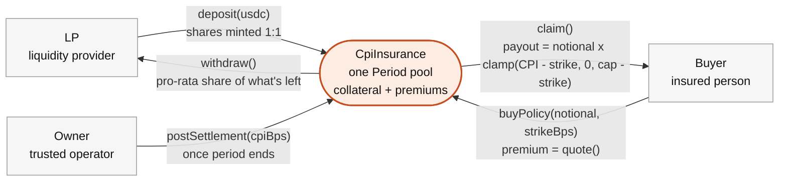
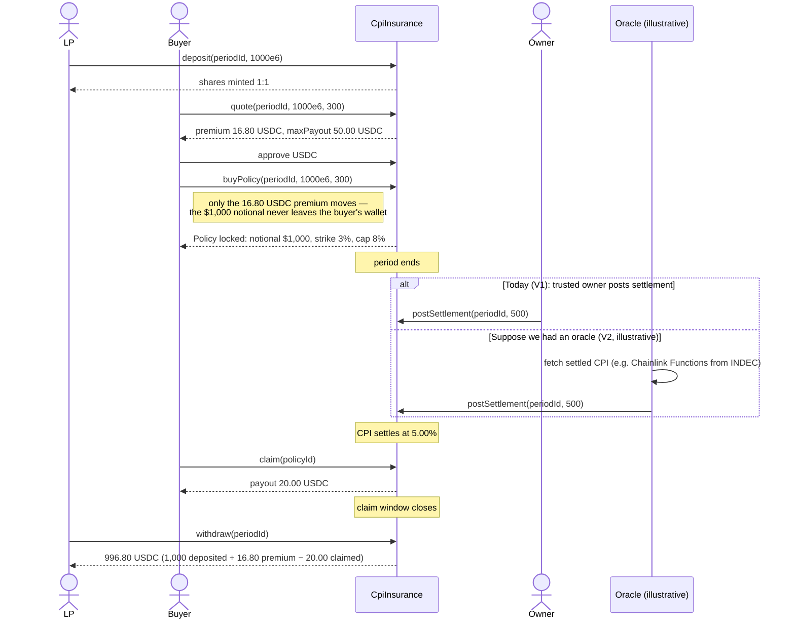

# Inflation Insurance

Built at **Aleph Hackathon — Buenos Aires, August 2026**.

**Repo:** https://github.com/lexfrl/inflation-insurance
**Live frontend:** https://inflation-insurance.vercel.app (auto-deploys on every push to `main`; contract addresses below are placeholders until the Base Sepolia deploy runs, so on-chain reads will show empty until then)

A parametric hedge against Argentina's monthly CPI print. You tell it how much
monthly spending to protect and above what inflation level; it tells you the
cost today and the maximum payout. No prediction-market jargon anywhere in
the product.

> **Polymarket tells you how likely inflation is. We let you hedge how much
> inflation hurts you.**

## The idea, in one picture

A Polymarket-style binary market on "Will CPI exceed 3%?" pays a fixed $1 per
share whether CPI comes in at 3.01% or 12%. That's fine for a prediction
market — the question really is just "did it happen?" — but it's a bad hedge:
your real-world damage from inflation keeps growing past the threshold while
the payout doesn't.

This product pays out **proportionally to the shock**, capped:

```
strike = 3%, cap = 8%, notional = $1,000

CPI 2%   -> payout $0
CPI 3%   -> payout $0
CPI 4%   -> payout $10
CPI 5%   -> payout $20
CPI 6%   -> payout $30
CPI 8%+  -> payout $50   (capped)
```

`payout = notional × clamp(CPI − strike, 0, cap − strike)`

You could approximate this today by manually buying five separate CPI-tier
markets on Polymarket. We package that payoff into one product: choose your
expenses, choose your strike, buy protection. Prediction markets are the
primitive; this is the insurance product built on top of it.

## How it's priced (the actual differentiator)

Polymarket prices one event: `P(CPI > 3%)`. This contract prices the whole
distribution — literally computing the expected value of the capped,
strike-shifted payoff:

```
Fair value = E[max(min(CPI, cap) − strike, 0)]
```

`CpiInsurance.quote()` does this on-chain: each period stores a discrete CPI
histogram (`cpiBucketsBps` / `probBps`, operator-supplied from recent INDEC
prints), and the premium is that histogram's expected payout times a load
factor (`loadBps`, e.g. `12000` = 1.2× EV). The load factor exists because at
premium == EV exactly, LPs have zero expected return and no reason to
deposit — it's the risk premium LPs are paid to underwrite the pool.

This is also the **single source of truth** for pricing: the frontend never
recomputes premium/payout in JavaScript, it only ever displays what
`quote()` returns on-chain.

## Architecture

Three roles share one pool per period — nobody but the buyer ever sees a
"share" or a "probability":



- **LP** funds the pool and takes the other side of the risk: deposits USDC
  pre-sale, withdraws principal + premiums − claims after the claim window
  closes.
- **Buyer** (the insured person) pays a premium for a policy and, if the
  settled CPI clears their strike, claims a payout capped at
  `notional × (cap − strike)`.
- **Owner** is the V1 trust root: creates each period's terms and histogram,
  then posts the single settled CPI value everything pays out against. No
  decentralized oracle yet (see "What's V1" below).

In code terms, that's one contract and a `periods` mapping:

```
CpiInsurance.sol
├── Period (per CPI period, e.g. "Argentina CPI, Sep 2026")
│   ├── LPs deposit USDC -> shares, 1:1                    [deposit]
│   ├── Buyers pay a premium for a Policy                  [buyPolicy]
│   │     Policy = { notional, strikeBps, maxPayout, ... }
│   ├── Owner posts the settled CPI once the period ends    [postSettlement]
│   ├── Buyers claim their payout                           [claim]
│   └── LPs withdraw their pro-rata share of what's left    [withdraw]
```

No factory, no per-pool deployment.
`quote()` is a `view` function so both `buyPolicy` and the frontend call the
exact same pricing code.

**Solvency invariant**, enforced on every purchase:

```solidity
totalMaxLiability + thisPolicysMaxPayout <= totalCollateral + totalPremiums
```

checked using `totalPremiums` *before* this policy's own premium is added —
a policy's own premium can never count toward backing itself. This is the
only capacity check the contract needs; it's covered by unit tests at the
exact boundary, by 20,000-run fuzz tests, and by a stateful invariant suite
(`forge test --match-contract Invariant`).

## Example: a buyer's walkthrough

Concrete numbers, taken straight from the test suite's founder's-example
fixture (`test_QuoteMatchesFounderExample`, `test_Claim_PaysCorrectAmount`) —
nothing here is rounded for the README. The diagram below is the full pool,
not just the buyer: it includes the LP who backs this period, and contrasts
today's trusted-owner settlement with the oracle-fed version from the "What's
V1" roadmap (that branch is illustrative — V1 ships only the owner path):



1. **Connect & pick a period.** The buyer connects a wallet and picks the
   open "Argentina CPI, Sep 2026" period, capped at 8%, priced off a
   histogram of `{2%, 4%, 6%, 8%}` at `{40%, 30%, 20%, 10%}`.
2. **Set spend & strike.** They want $1,000/month of spending protected
   above 3% inflation.
3. **Read the quote.** `quote(periodId, 1000e6, 300)` — called live, same
   code path the frontend and `buyPolicy` both use — returns:
   - `premium = 16.80 USDC`
   - `maxPayout = 50.00 USDC` (= $1,000 × (8% − 3%))
4. **Approve & buy.** One USDC approval, then `buyPolicy(periodId, 1000e6,
   300)` pays the 16.80 USDC premium and locks in a `Policy` with that
   notional, strike, and max payout. The buyer only ever sends the
   **premium** — the `1000e6` notional is a pricing input (how much spending
   to protect), not USDC the buyer transfers; the $1,000 of real collateral
   backing the payout comes from the LP's deposit, not the buyer.
5. **Wait for settlement.** The period ends; the owner calls
   `postSettlement(periodId, 500)` — CPI printed at 5.00%.
6. **Claim.** `claim(policyId)` pays out
   `min(5%, 8%) − 3% = 2%` of the $1,000 notional — **20.00 USDC** — turning
   a 16.80 USDC premium into a 20.00 USDC payout because the shock (5%)
   cleared the strike (3%).

Two outcomes worth naming explicitly:

- **CPI settles at or below 3%:** the policy pays out $0. The premium isn't
  refunded — exactly like a traditional insurance premium, it bought
  protection for the period, not a guaranteed return.
- **CPI settles at or above 8% (the cap):** payout is capped at $50, no
  matter how far above 8% the print lands — the same cap that keeps the
  pool's liability bounded and solvent.

Miss the claim deadline and the payout right simply lapses; LPs later
withdraw whatever's left in the pool, unclaimed payouts included.

## What's V1 (stated plainly, not hidden)

- **Trusted oracle.** CPI settlement is posted by a single owner address —
  there's no decentralized oracle. V2: Chainlink Functions pulling from
  INDEC, or a signed-oracle pattern.
- **No settlement escape hatch.** If the owner never calls
  `postSettlement`, LP funds are locked in that period permanently — there's
  no timeout/refund path. This is a real cost of the V1 trust model, not an
  oversight.
- **Operator-supplied histogram.** The CPI probability distribution used for
  pricing is set once by the operator at period creation, not derived from a
  live market. V2: aggregate real prediction-market prices or a growing
  on-chain track record.
- **No factory.** One contract holds all periods. V2:
  `CpiInsuranceFactory` deploying minimal-proxy pools per period/operator.
- **Policies aren't tokenized.** A policy is a struct + owner mapping, not
  an ERC721. V2: make them transferable/tradeable.

## Repo layout

```
contracts/          Foundry project
  src/CpiInsurance.sol   core contract
  src/MockUSDC.sol       open-mint testnet USDC stand-in
  test/                  24 tests: unit, fuzz (20k runs), stateful invariant
  script/Deploy.s.sol    deploys MockUSDC + CpiInsurance
  script/Demo.s.sol      3-phase real-broadcast lifecycle demo
  script/demo.sh         orchestrates the 3 phases with real wall-clock waits
web/               Next.js + wagmi/viem + RainbowKit frontend
  src/app/page.tsx       buyer flow (protect spending)
  src/app/lp/page.tsx    LP flow (provide liquidity)
  src/app/admin/page.tsx owner-only: create periods, post settlements
```

## Running it

### Contracts

```
cd contracts
forge build
forge test -vvv                                    # 24 tests, all green
forge test --match-contract Fuzz --fuzz-runs 20000  # pricing/solvency properties
forge test --match-contract Invariant -vvv          # stateful solvency fuzzing
```

### Full lifecycle demo (local anvil, real broadcast transactions)

`vm.warp` cannot survive a real broadcast on any chain — Foundry validates
every script against a broadcast-equivalent replay that ignores it, anvil
included. So the demo is three real transactions driven by real elapsed
time, not one script with a time-travel cheatcode:

```
anvil &
cd contracts
bash script/demo.sh
```

Deploys fresh contracts, creates a period, deposits, buys a policy, waits
for the period to end, posts settlement, claims, waits for the claim window
to close, and withdraws — printing the USDC balance change at each step.

### Frontend

```
cd web
pnpm install
cp .env.local.example .env.local   # fill in addresses below (or your own deploy)
pnpm dev
```

The frontend reads its ABI directly from `contracts/out` via
`wagmi.config.ts` (`pnpm wagmi generate` after any contract change +
`forge build`) — it can't drift from what's actually deployed.

## Deployed addresses

`.env.local` is gitignored, so here's what a reviewer needs to plug in:

**Local anvil** (chain id `31337`, rpc `http://127.0.0.1:8545`) — the
values used during development, redeployed fresh by `forge script
script/Deploy.s.sol --broadcast` any time:

| Contract     | Address |
|--------------|---------|
| MockUSDC     | `0x5FbDB2315678afecb367f032d93F642f64180aa3` |
| CpiInsurance | `0xe7f1725E7734CE288F8367e1Bb143E90bb3F0512` |

**Base Sepolia** (chain id `84532`) — _pending a funded deployer key,
see below._ The live Vercel frontend currently points at placeholder
addresses (`0x0...dEaD`) on this chain until that deploy runs.

## CI/CD

- **`.github/workflows/ci.yml`** — every push/PR to `main`: `forge build`
  + `forge test` (unit, 10k-run fuzz, invariants) + `forge coverage`, and
  `pnpm lint` + `pnpm build` for the frontend.
- **`.github/workflows/deploy-frontend.yml`** — every push to `main`: builds
  and deploys the frontend to Vercel (https://inflation-insurance.vercel.app).
  Uses the Vercel CLI + an API token (`VERCEL_TOKEN`/`VERCEL_ORG_ID`/
  `VERCEL_PROJECT_ID` repo secrets) rather than Vercel's native GitHub App,
  since installing that app requires an interactive OAuth screen.
- **`.github/workflows/deploy-contracts.yml`** — **manual trigger only**
  (Actions tab → "Deploy contracts (Base Sepolia)" → Run workflow).
  Deliberately not on every push: a contract deploy always creates a new
  address, unlike a web app redeploy. Needs a `BASE_SEPOLIA_DEPLOYER_KEY`
  repo secret (add your own — generate with `cast wallet new` in your own
  terminal, fund it via a Base Sepolia faucet, then add it under Settings →
  Secrets and variables → Actions). After it runs, copy the printed
  addresses into the Vercel project's env vars and this README.

## Status / what's left

- [x] Contract, pricing, solvency invariant, full test suite
- [x] Frontend (buyer / LP / admin flows) verified against local anvil
- [x] GitHub repo, CI, and Vercel auto-deploy for the frontend
- [ ] Base Sepolia deployment — blocked on a funded deployer key
- [ ] Live demo video
- [ ] DoraHacks submission

Built with Foundry, Next.js, wagmi/viem, and RainbowKit.
